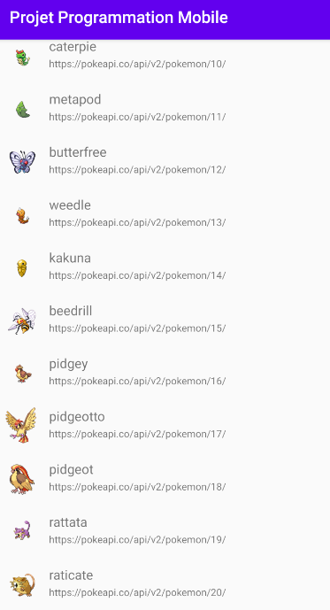

# Application Pokémon 

Petite application récupérant des informations de pokémon depuis l'api PokéApi V2. Et les stock en mémoire dans une liste. 
Cette application utilise le pattern MVC et est codée en Java.

## Prérequis 

 - Android Studio 
 - Récupérer la branche **Finale**

## Consignes respectées 
 -  Pattern MVC
 -  Appels REST
 -  Ecrans : 2 Activités 
 -  Affichage d'une liste dans un RecyclerView 
 - Changement d'activité lors de l'appui sur un élément de la liste 

## Ajouts de ma part

 - Changement de l'icone de l'app
 - Icone de pokémon dans la liste RecyclerView 
 - Affichage du pokémon en grand sur une deuxième activité  
 - Changement de couleur du fond.
 - Suppression de l'action bar sur la deuxième activité 

## Amélioration en cours et prévue

 - Modification de la deuxième activité pour y ajouter plus d'information sur un pokémon ( en cours )
 - Modification de la liste pour ne plus afficher l'url mais une autre information ( en cours )
 - Ajout d'une barre de recherche et de filtres ( recherches en cours )
 - Ajout d'autres activités ou fragments ( non commencé ) 
 - Clean architecture et Gitflow propre 

## Captures d'écrans 

**Ecran d’accueil**  
Affiche la liste des pokémons 

**Ecran détails des pokémons**  
Affiche le pokémon en plus grand et ses détails ( les champs sont laissés par défaut le temps pour une future mise à jour ) 

